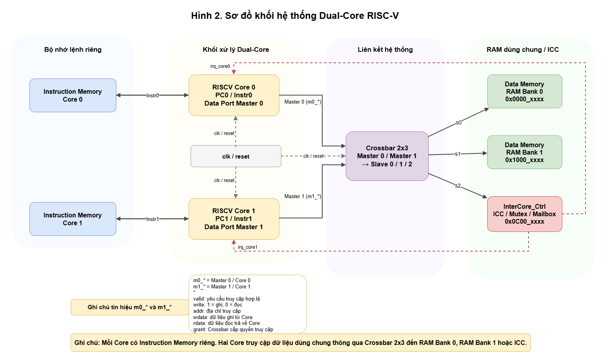

# RISC-V Dual-Core SoC with Hardware Synchronization


-orange.svg)


## 📌 Project Overview
This project implements a **Dual-Core RISC-V (RV32I) System-on-Chip (SoC)** from scratch using Verilog HDL. It explores Hardware-Software Co-design techniques to solve critical multiprocessor challenges, specifically bus contention and memory race conditions. 

The system features a **2x3 Crossbar Interconnect** with Round-Robin arbitration and an **Inter-Core Controller (ICC)** that provides an Atomic Hardware Mutex. The firmware is written in C++ (Bare-metal), utilizing a Spinlock mechanism to ensure safe and synchronized access to shared memory.



## ✨ Key Features
* **Dual RV32I Cores:** Two independent single-cycle RISC-V processors with dedicated Instruction Memories (ROM) to prevent fetch-cycle bottlenecks.
* **Core Logic Optimization:** Fixed and optimized base-code decoding logic to fully support `JALR`, `BNE`, and `LUI` instructions for C++ compiler compatibility.
* **2x3 Crossbar Interconnect:** High-performance matrix allowing parallel memory access (2 Masters to 3 Slaves) without blocking, unlike traditional shared buses.
* **Round-Robin Arbitration:** Fair bus allocation that forces a temporary `Stall` on conflicting cores, preventing system deadlocks.
* **Hardware Mutex (Atomic Test-and-Set):** A single-cycle hardware lock mechanism located at `0x0C00_0000` to protect Critical Sections.
* **Firmware Spinlock:** C++ implementation of `while(ICC_MUTEX == 1)` to enforce software-level waiting when shared resources are locked.

## 🏗️ System Architecture & Memory Map

### Address Decoding (Slaves)
| Peripheral / Memory | Base Address | Size | Description |
| :--- | :--- | :--- | :--- |
| **Instruction Memory 0** | `0x0000_0000` | 4 KB | Core 0 ROM (Independent) |
| **Instruction Memory 1** | `0x0000_0000` | 4 KB | Core 1 ROM (Independent) |
| **Shared RAM Bank 0** | `0x0000_0200` | 4 KB | Shared Data Memory |
| **Shared RAM Bank 1** | `0x0000_1000` | 4 KB | Shared Data Memory |
| **ICC / Mutex** | `0x0C00_0000` | 32-bit | Hardware Sync Controller |

*Note: The Stack Pointer (SP) is isolated for each core (`0x1F0` for Core 0 and `0x3F0` for Core 1) to prevent firmware memory overlap.*

## ⚙️ Prerequisites

To simulate the hardware and compile the firmware, you will need the following tools:
1. **ModelSim:** For RTL simulation and waveform viewing.
2. **[RISC-V GNU Compiler Toolchain](https://github.com/riscv-collab/riscv-gnu-toolchain):** Required to compile the C++ firmware into RISC-V machine code (`riscv-none-elf-gcc`).

## 🚀 Getting Started

### 1. Clone the Repository
```bash
git clone [https://github.com/nguyendinhnhatnguyen/riscv-multicore-project.git](https://github.com/nguyendinhnhatnguyen/riscv-multicore-project.git)
cd riscv-multicore-project
```
### 2. Build the Firmware (C++ to Machine Code)
Navigate to the `software` directory and use the provided batch script to compile the C++ source files into hex strings for the ROM.
```Bash
cd software
# Ensure riscv-none-elf-gcc is in your system PATH
build.bat
```
This will generate `core0.txt` in the software/asm/ folder and then copy its content into `core1.txt` in the same folder, which are automatically loaded by the Verilog testbench.

### 3. Run RTL Simulation
Open ModelSim.

Change the directory to the project root.

Compile all Verilog files in `rtl/` and `sim/`.

Start the simulation with the testbench:

```Tcl
vsim work.DualCore_Top_tb
```

Add the necessary waveforms (or load the provided `modelsim/wave.do` script) and run the simulation:

```Tcl
run 5000ns
```
### 4. Synthesis
Open the project in Quartus Prime 13.0 SP1, target family device Cyclone IV E, and click Start Compilation. The timing.sdc file is included to ensure correct $F_{max}$ analysis.

## 📂 Directory Structure
```Plaintext
📦 RISCV-Multicore-Project
 ┣ 📂 archive/            # Deprecated RTL and Assembly files
 ┣ 📂 doc/                # Project reports and presentation slides
 ┣ 📂 image/              # Diagrams and waveform screenshots for documentation
 ┣ 📂 modelsim/           # ModelSim wave configurations (.do)
 ┣ 📂 rtl/                # Verilog source files
 ┃ ┣ 📂 core/             # RISC-V Single-Cycle Core
 ┃ ┣ 📂 interconnect/     # Crossbar 2x3 Matrix
 ┃ ┣ 📂 ip/               # Inter-Core Controller (ICC / Mutex)
 ┃ ┗ 📂 memory/           # Instruction ROM & Data RAM
 ┣ 📂 sim/                # Testbenches (DualCore_Top_tb.v)
 ┣ 📂 software/           # C++ Firmware and Compiler Scripts
 ┃ ┣ 📂 asm/              # Generated machine code (.txt)
 ┃ ┣ 📂 inc/              # C++ Headers (icc.h)
 ┃ ┣ 📂 linker/           # Memory map layout (.ld)
 ┃ ┣ 📂 src/              # C++ source code (main.cpp, startup.S)
 ┃ ┗ 📜 build.bat         # Compilation script
 ┗ 📜 README.md           # Project documentation
```
## 🙏 Acknowledgments & References
This project builds upon foundational open-source IP cores and standard toolchains. We would like to express our gratitude to:

* **Base Core IP**: The original Single-Cycle RISC-V processor architecture was referenced from [Govardhan-R / RISCV-Single-Cycle-Processor](https://github.com/govardhnn/RISCV_Single_Cycle_Processor.git). (Heavy modifications were applied to Datapath, ALU, and Decoders for Multi-core & C++ support).

* **Compiler**: [RISC-V GNU Compiler Toolchain](https://github.com/xpack-dev-tools/riscv-none-elf-gcc-xpack/releases/).

* **Textbook**: David Money Harris & Sarah L. Harris. Digital Design and Computer Architecture: RISC-V Edition.

* **ISA Specification**: The RISC-V Instruction Set Manual (Volume I: Unprivileged ISA).

## 👨‍💻 Authors
* **Nguyễn Đình Nhật Nguyên** (Student ID: 23521043)

* **Lê Hưng Phát** (Student ID: 23521139)

* **University of Information Technology (UIT), VNU-HCM**
